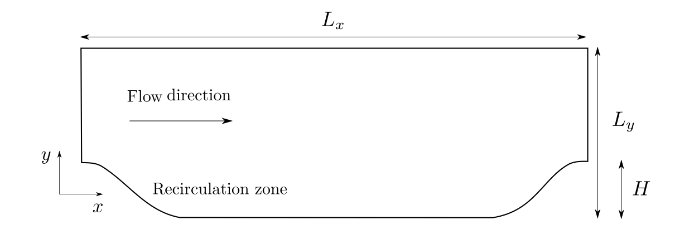
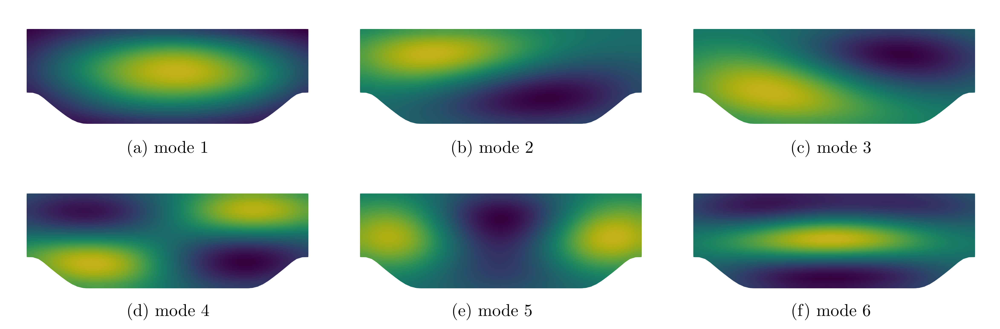
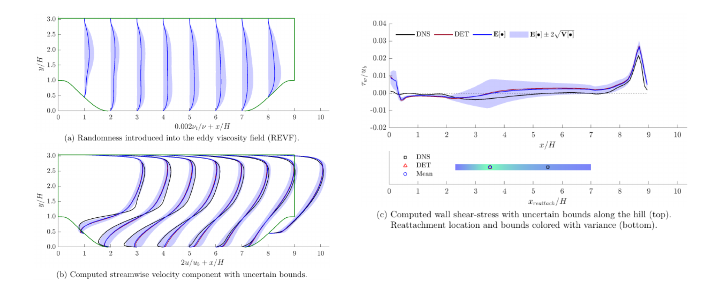

Checking for renaming repo

# Uncertainty Qauntification in CFD simulations

This repository contains codes developed during my PhD at University of Groningen.
- [OpenFOAM](/OpenFOAM) contains applications (solvers, utilities) and src (fvOptions) compiled with version (v2106).
- [scripts](/scripts) contains Python and MATLAB scripts for pre- and post- processing. Also contains TensorFlow modular code for data-driven project for UQ analysis.

## Stochastic Solver

**Stochastic Model - algorithm and implementation**
Using an exiting deterministec solver ```pimpleFoam```, a stoachastic solver based on Intrusive Polynomial Chaos (IPC) was developed in OpenFOAM called as [```gPCModelFormFoam```](/OpenFOAM/v2106/applications/solvers/gPCModelFormFoam). More details on this solver can be found in the following articles:

[1] Quantification and propagation of model-form uncertainties in RANS turbulence modeling via intrusive polynomial chaos. _International Journal for Uncertainty Quantification_. (under review)

[2] Intrusive Polynomial Chaos for CFD Using OpenFOAM. Computational Science, _ICCS 2020, Lecture Notes in Computer Science. Springer, Cham._

Important steps of the algorithm implemented are shown in the figure (below). <br />


**Benchmark Case - geometry, mesh and model parameters**




## Stochatic Simulation
The above case setup is used in section 6.1 from \[1\] and can be found in [```tutorials as periodicHill_REVF```](/OpenFOAM/v2106/tutorials/incompressible/gPCModelFormFoam/periodicHill_REVF). The steps involed in setting up and running a stochastic RANS simulation for flow over _Periodic Hills_ with a _random eddy-viscoity field_ (REVF) are as follows:

#### 1) Uncertainty Quantification 
- After obtaining a (modeled) eddy viscosity field from a deterministic RANS simulation we can generate a Random Eddy Viscosity Field (REVF). The eigenmodes of the REVF can be obtained using a KL decomposition (```expGp_gPCKLE_LogNProc.py``` in [```tutorials as periodicHill_REVF```](/OpenFOAM/v2106/tutorials/incompressible/gPCModelFormFoam/periodicHill_REVF)). 
- For convinience we already provide these modes generated over a coarse mesh and projected onto the stochastic RANS simulation mesh. These projected modes can be located in the ```0``` directory as _expGpCoeffs*_. 
- These eigenmodes will be used by the gPCModelFormFoam solver to contruct the PCE coefficients of the REVF (only at the start of the simulaiton).
- Below are the first six KL expansion modes shifted and normalized to the range of 0 (darkest) and 1 (lightest).
    

#### 2) Uncertainty Propagation
- The first mode of velocity and pressure are initialized using the solution from the deterministic simulation, to speed up the convergence of the stochastic solver. 
- Boundary conditions of the remaining modes are specified using ```0/UQpBC.H``` and ```0/UQUBC.H```. 
- The discretization schemes in ```system/fvSchemes``` and the solver settings in ```system/fvSolution``` are the same as that of the deterministic simulation.
- Solver parameters of ```gPCModelFormFoam``` are controled by ```system/controlDict```. In this tutorial we have particularly used the following solver paramters: 

    ```C++
    ...
    transientMode   on;    // 'off' for steady-state simulation 
    expItrMax       1;     // controls the number of explicit iterations
    Ptrunc          10;    // controls the number of modes to be solved
    ...
    ```
- The ```run``` script contains commands to run a batch job on SLURM based cluster. The solver returns all the modes of velocity and pressure at ```writeInterval``` in ```system/controlDict```.
- After obtaining the PCEs of velocity and pressure, further post-processing to obtain PCEs of other QoIs (like wall-shear stess) is straight-forward. 
- In the figure below we have mean and variance of (a) turbulent viscosity, (b) streamwise velocity and (c) wall shear-stress at different locations in x-direction for the flow over periodic hills. Compared with deterministic (DET) and DNS results. Legend in (c) (top) applies to (a) and (b) as well. 
    

### Further Study
- Varying correlation length scales
- Techniques to overcome the curse of dimensionality
- Comparison between turbulence models
- Reducing uncertainty via data assimilation
- Random Reynolds-stress tensor field (RRSTF)

Please refer to \[1\] for detailed analysis.
